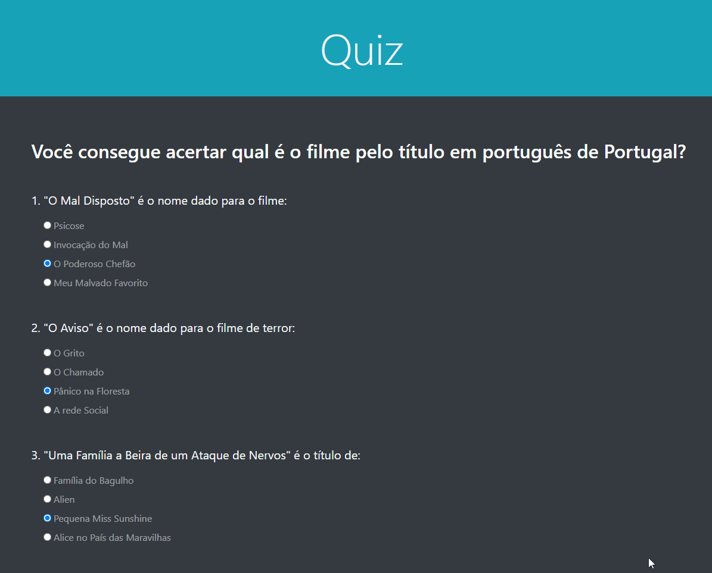
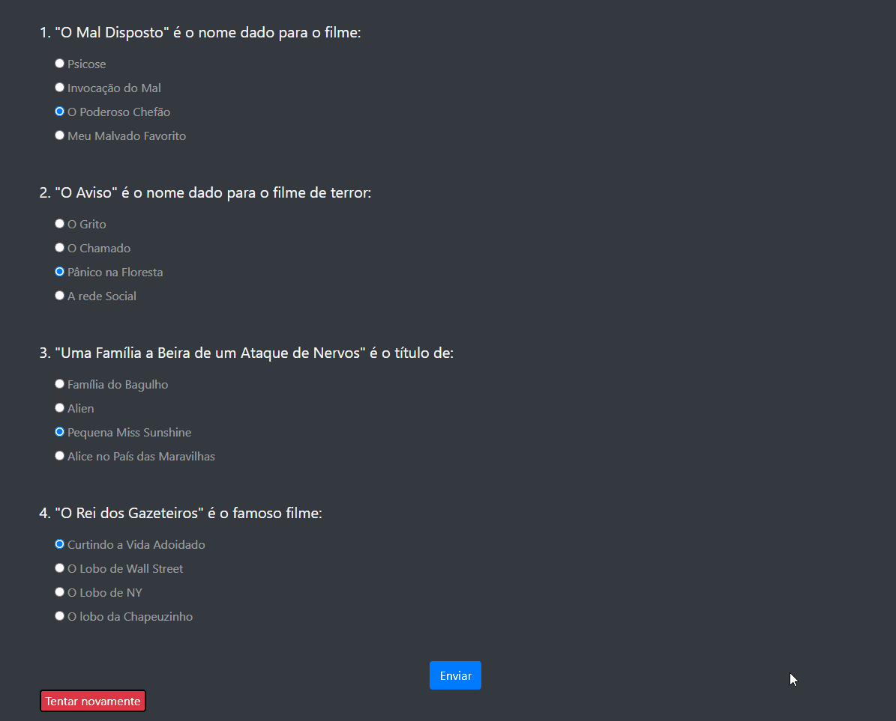
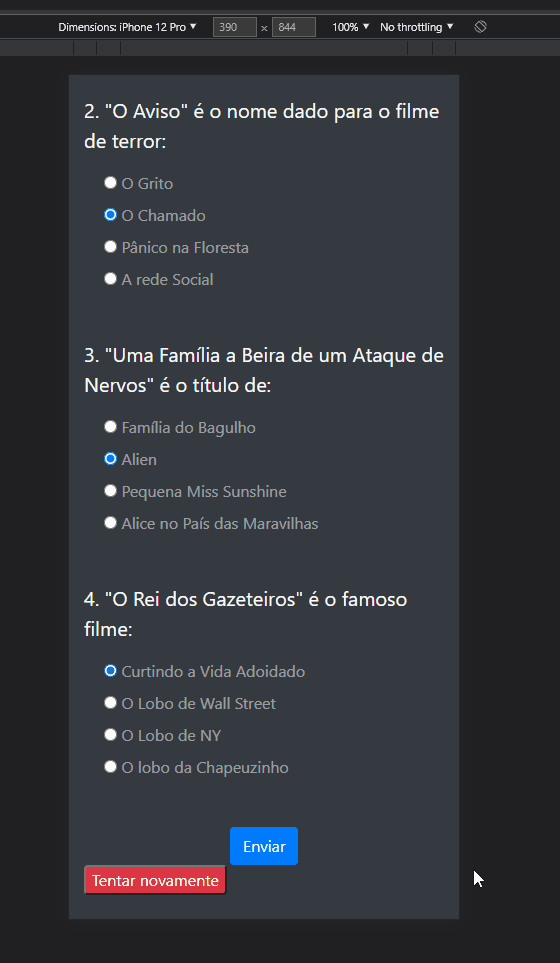

# Projeto Quiz Interativo 📝

Página desenvolvida para exercitar conceitos do DOM, setTimeOut e setInterval. Também tive um contato com o bootstrap neste projeto

## Tecnologias

- Javascript
- HTML
- Bootstrap

---

<h2 align="center">Viewport inicial</h2>

---

<h2 align="center">Interação Final</h2>

<h2 align="center">Interação Final - Mobile</h2>

